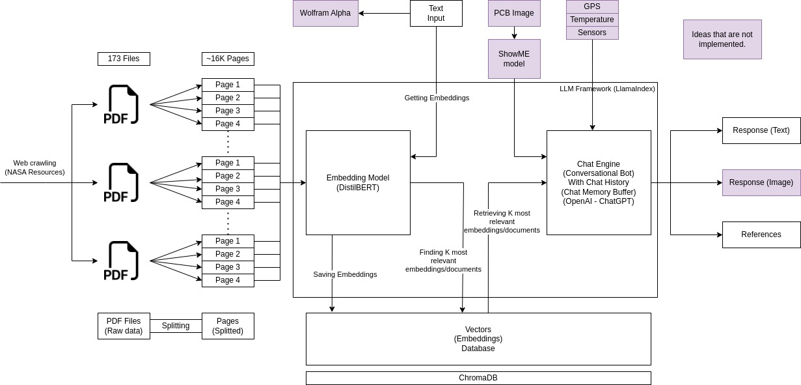

# STAR - NASA Space Apps Challenge
Our implementation for the challenge "STAR: Revolutionizing Technical Standards with AI" from NASA Space Apps Challenge 2023.

# High-level Summary
We propose to develop a conversational chatbot, to help mission designers with procedures and recommendations. The chatbot will be able to take images as input and solve equations using WolframAlpha. We will also develop a web application to make it easy for mission designers to interact with the chatbot and other tools and resources to ensure the safety, reliability, and effectiveness of aerospace products.

# Project Goal
To develop a conversational chatbot that can help mission designers with procedures and recommendations.

# Project Approach
1. Crawl all of the NASA standards documents and split them into pages and chunks.
2. Index the data using LlamaIndex, an open-source LLM framwork that can communicate with multiple tools and conversational chatbots.
3. Use GPT3.5, a large language model from Open AI, as the conversational chatbot.
4. Use distilBERT model for embeddings and use ChromaDB as a vector database for faster retrieval.
5. Develop a web application / mobile app that will allow mission designers to interact with the chatbot easily. The web application / mobile app will also provide access to other tools and resources that mission designers may need.

# Project Features:
The STAR Conversational Chatbot will have the following features:
1. It will be able to answer questions about NASA standards and procedures.
2. It will be able to generate recommendations for mission designers.
3. It will be able to take images as input and solve equations.
4. It has a model 'ShowME' that can understand the uploaded images of PCBs and circuits and explain them. It is a two-part model, that is trained on understanding schemas of PCBs, explaining them, and solving their problems, and in the second phase, it learns to convert images of PCBs/circuits into schemas that the model is able to explain and detect errors in.
5. It can give procedures related to the environmental conditions (GPS, temperature, sensors, etc).
6. It will be accessible through a web application or mobile.
7. Very safe and fast to use, as it saves data in a local database, the only thing to change here is to switch from OpenAI's ChatGPT to another conversational chatbot that can be downloaded and used locally, we did not take this approach for now due to lack of computational resources.

# Conclusion:
The STAR Conversational Chatbot has the potential to be a valuable tool for mission designers. The project team is committed to ensuring the safety, reliability, and effectiveness of aerospace products.

# Project Pipeline / Diagram:

# Space Agency Data / References
- [NASA Standards](https://standards.nasa.gov/all-standards)
- [DistilBERT Paper](https://arxiv.org/abs/1910.01108)
- [LlamaIndex Documentation](https://docs.llamaindex.ai/en/stable/)
- [ChromaDB Documentation](https://docs.trychroma.com/)
- [LangChain Documentation](https://python.langchain.com/docs/get_started/introduction)
